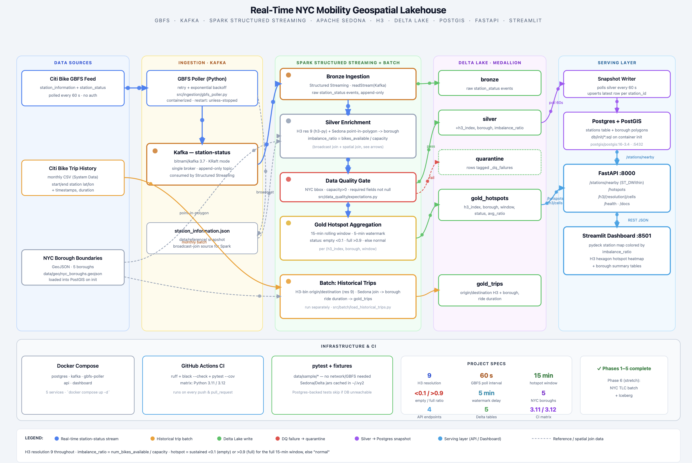
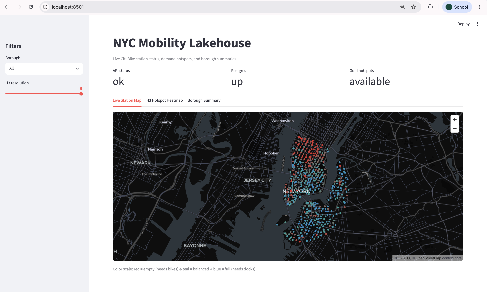
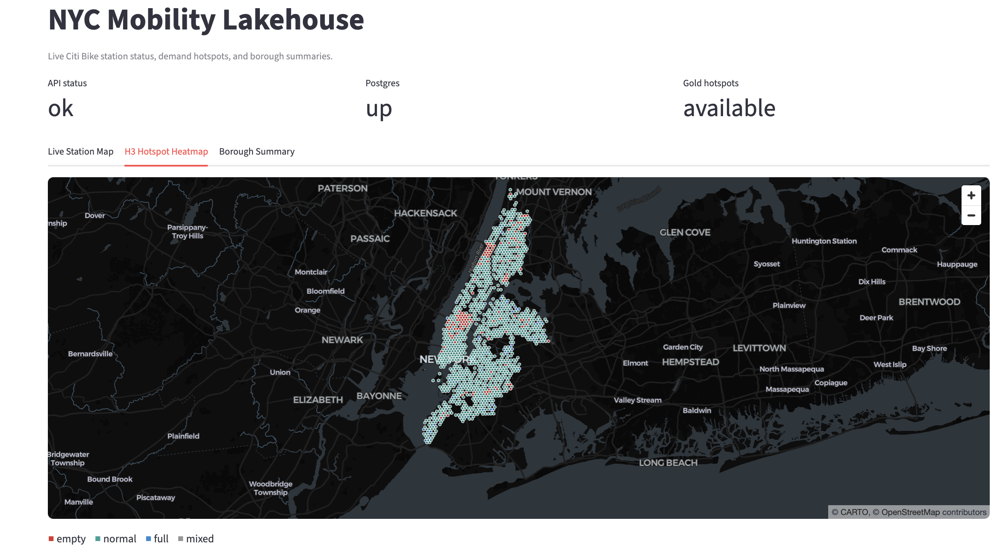
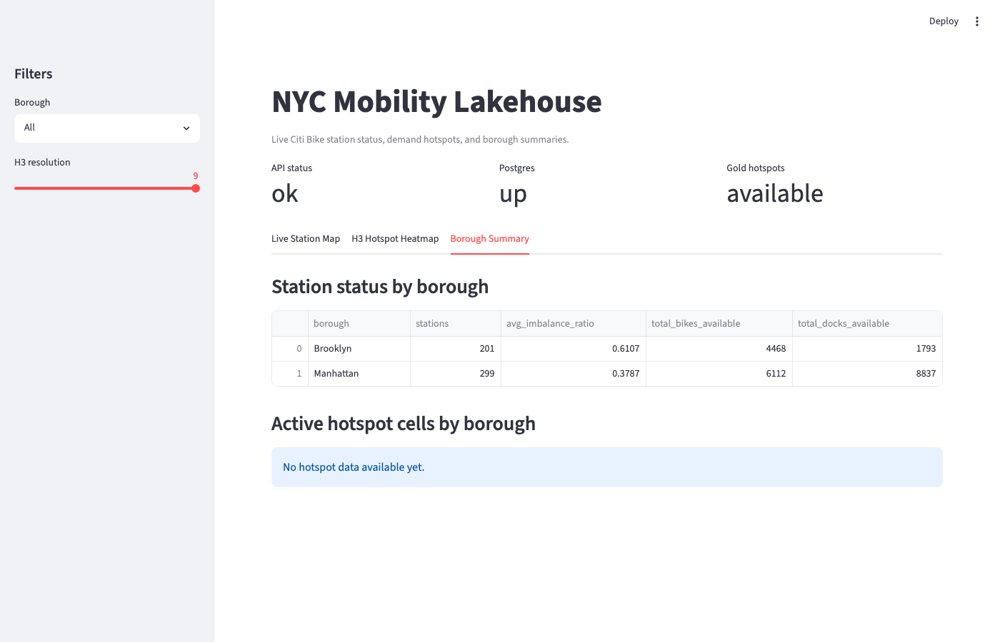
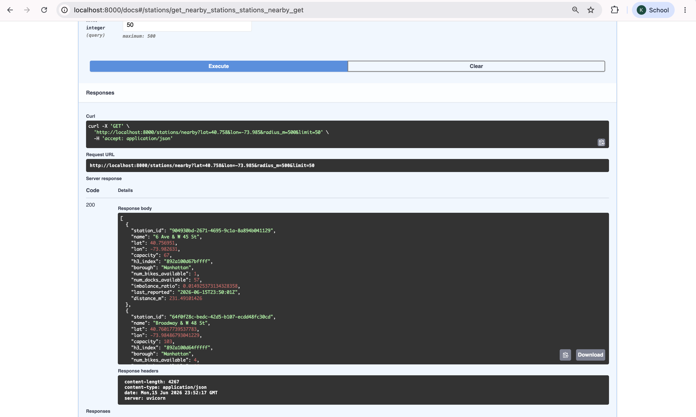
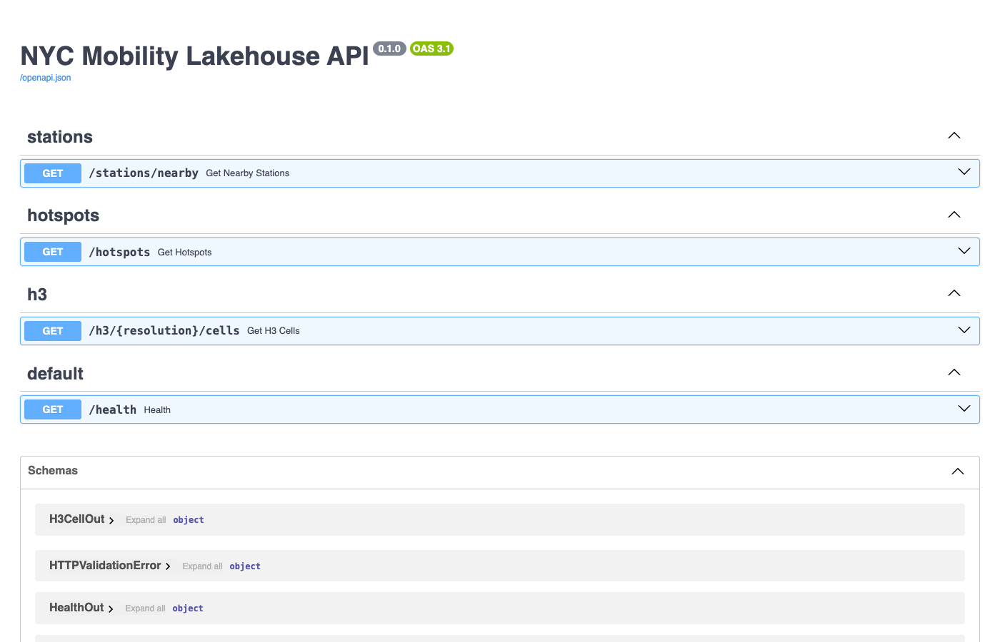

# Real-Time NYC Mobility Geospatial Lakehouse

> **Bike-share operators hemorrhage revenue when stations go empty or jammed.** This system ingests the live Citi Bike GBFS feed every 60 seconds, enriches each event with H3 spatial indexes and NYC borough polygons via Sedona point-in-polygon joins, and surfaces sustained imbalance hotspots to a live map dashboard — so rebalancing trucks can move before riders are stranded.

<div align="center">

[](https://github.com/20krish20/NYC-Mobility-Geospatial-Lakehouse/actions/workflows/ci.yml)
&nbsp;

&nbsp;

&nbsp;

&nbsp;

&nbsp;


</div>

---

## Architecture

> Click the screenshot to open the **interactive animated diagram** with live flow paths.

<a href="https://20krish20.github.io/NYC-Mobility-Geospatial-Lakehouse/architecture.html">
  
</a>

<p align="center"><sub>↑ Animated version shows data flowing through each layer in real time · <a href="https://20krish20.github.io/NYC-Mobility-Geospatial-Lakehouse/architecture.html">Open interactive diagram →</a></sub></p>

---

## What it looks like running

<table>
<tr>
<td width="50%">

**Live Station Map**
<br/>2,275 stations colored by imbalance ratio — red = empty, blue = full



</td>
<td width="50%">

**H3 Hotspot Heatmap**
<br/>Resolution-9 hexagons flagged when sustained empty/full for 15 min



</td>
</tr>
<tr>
<td width="50%">

**Borough Summary**
<br/>Rolling stats per borough — avg ratio, hotspot count, trip volume



</td>
<td width="50%">

**FastAPI — `/stations/nearby`**
<br/>PostGIS `ST_DWithin` → H3 index + borough + imbalance ratio + distance



</td>
</tr>
</table>

<details>
<summary><b>API overview (all endpoints)</b></summary>



</details>

---

## Quickstart

**Prerequisites:** Docker Desktop · Java 17 · Python 3.11+

```bash
# 1 — spin up Postgres/PostGIS, Kafka, GBFS poller, API, and dashboard
docker compose up -d

# 2 — fetch station reference data onto the host (Spark broadcast join source)
PYTHONPATH=src python3 -c "
from ingestion.gbfs_poller import refresh_station_information, PollerConfig
import requests
refresh_station_information(PollerConfig(), requests.Session())
"

# 3 — start Spark Structured Streaming → bronze / silver / gold Delta tables
#     (Kafka external listener is 9094 when running outside Docker)
KAFKA_BOOTSTRAP_SERVERS=localhost:9094 PYTHONPATH=src python3 -m streaming.station_status_stream

# 4 — populate Postgres stations table from silver Delta (polls every 60 s)
PYTHONPATH=src python3 -m serving.snapshot_writer
```

| Service | URL |
|---|---|
| Streamlit dashboard | http://localhost:8501 |
| FastAPI docs | http://localhost:8000/docs |
| Health check | `curl http://localhost:8000/health` |

> Steps 3 & 4 run on the host JVM. Spark downloads Sedona / Delta / Kafka jars from Maven Central on first run (~90 s), cached to `~/.ivy2` afterwards.

<details>
<summary><b>Run tests without any infrastructure</b></summary>

All tests use committed fixtures — no live GBFS feed, no Kafka, no Postgres needed:

```bash
pip install -e ".[dev]"
pytest --cov=src
ruff check . && black --check .
```

Postgres-backed tests (`test_api.py`, `test_snapshot_writer.py`) auto-skip if Postgres isn't reachable — run `docker compose up -d postgres` to enable them.

</details>

---

## How the pipeline works

```
Citi Bike GBFS (every 60 s)
   └─► gbfs_poller.py ──────────────────► Kafka "station-status"
                                                  │
                                       Spark Structured Streaming
                                         ├─ broadcast join station_information
                                         ├─ H3 index res 9 per station lat/lon
                                         ├─ Sedona point-in-polygon → borough
                                         ├─ imbalance_ratio = bikes / capacity
                                         └─ 15-min rolling window aggregation
                                                  │
                                       Delta Lake (medallion)
                                         ├─ bronze      raw station_status events
                                         ├─ silver      +h3_index +borough +ratio
                                         ├─ gold        hotspot aggregates per cell
                                         └─ quarantine  DQ failures (bbox / nulls)
                                                  │
                               ┌──────────────────┴──────────────────┐
                        snapshot_writer                          FastAPI :8000
                    silver → Postgres upsert             /stations/nearby (ST_DWithin)
                               │                         /hotspots  /h3/{res}/cells
                        PostGIS :5432                               │
                                                          Streamlit :8501
                                                       live map · H3 heatmap · borough panel
```

### Hotspot definition

A cell is flagged only when **every reading** in the 15-minute window breaches the threshold — no false alarms from brief dips:

| Status | Condition |
|---|---|
| `empty` | `max_ratio < 0.1` for the full window |
| `full` | `min_ratio > 0.9` for the full window |
| `normal` | everything else |

---

## Tech stack — where each technology is demonstrated

| Technology | What it does here | Key file |
|---|---|---|
| **Apache Kafka** | GBFS events → `station-status` topic, KRaft single-broker | [gbfs_poller.py](src/ingestion/gbfs_poller.py) |
| **Spark Structured Streaming** | Reads Kafka, enriches, writes Delta | [station_status_stream.py](src/streaming/station_status_stream.py) |
| **Apache Sedona** | Point-in-polygon: station lat/lon → NYC borough | [spatial_join.py](src/streaming/spatial_join.py) |
| **H3** | Resolution-9 spatial indexing (~city-block cells) | [h3_utils.py](src/streaming/h3_utils.py) |
| **Delta Lake** | Medallion architecture: bronze / silver / gold / quarantine | [station_status_stream.py](src/streaming/station_status_stream.py) |
| **Data Quality** | NYC bbox · capacity > 0 · null checks · quarantine writes | [expectations.py](src/data_quality/expectations.py) |
| **PostGIS** | `ST_DWithin` nearest-station queries · borough polygons | [db.py](src/serving/api/db.py) |
| **FastAPI + Pydantic v2** | REST serving layer with OpenAPI docs | [main.py](src/serving/api/main.py) |
| **Streamlit + pydeck** | Live map + H3 heatmap + borough summary | [app.py](src/serving/dashboard/app.py) |
| **Docker Compose** | Full stack: postgres · kafka · poller · api · dashboard | [docker-compose.yml](docker-compose.yml) |
| **GitHub Actions** | Lint + pytest matrix on Python 3.11 / 3.12 | [ci.yml](.github/workflows/ci.yml) |

---

## Repo layout

```
src/
  ingestion/          gbfs_poller.py — polls GBFS, publishes to Kafka
  streaming/          Spark Structured Streaming enrichment + hotspot detection
    station_status_stream.py
    h3_utils.py
    spatial_join.py   Sedona point-in-polygon helpers
    hotspot_detection.py
  batch/              load_historical_trips.py — Citi Bike CSVs → gold_trips
  serving/
    api/              FastAPI app + routers + PostGIS db layer
    dashboard/        Streamlit app
  data_quality/       expectations.py — bronze → silver DQ checks
tests/                pytest, all fixtures committed — no live infra needed
data/
  geo/                NYC borough GeoJSON (committed)
  sample/             station_status + trip fixtures for tests
docker/               per-service Dockerfiles
db/init/              PostGIS init SQL (borough polygons loaded on container start)
docs/
  architecture.html   interactive animated diagram
  screenshots/
```

---

## Phases completed

| Phase | What was built | Status |
|---|---|---|
| 1 — Foundations | Docker Compose, PostGIS init, GBFS poller with retry/backoff | ✅ |
| 2 — Streaming enrichment | Spark Structured Streaming, H3, Sedona spatial join, bronze/silver Delta | ✅ |
| 3 — Hotspot detection | 15-min rolling window aggregation, gold_hotspots table | ✅ |
| 4 — Historical batch + DQ | Citi Bike trip CSV → gold_trips, data quality checks + quarantine | ✅ |
| 5 — Serving layer | FastAPI + PostGIS, Streamlit dashboard, snapshot writer | ✅ |
| 6 — TLC large-scale batch | NYC TLC trip data + Iceberg table format | stretch |
